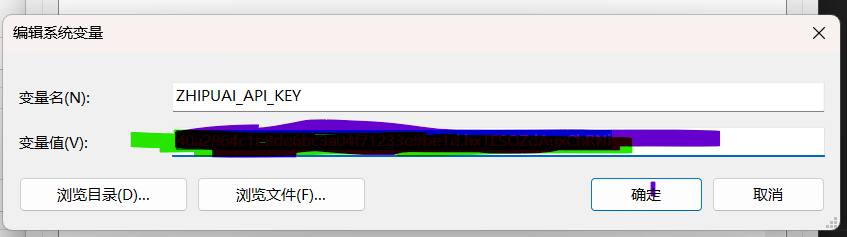
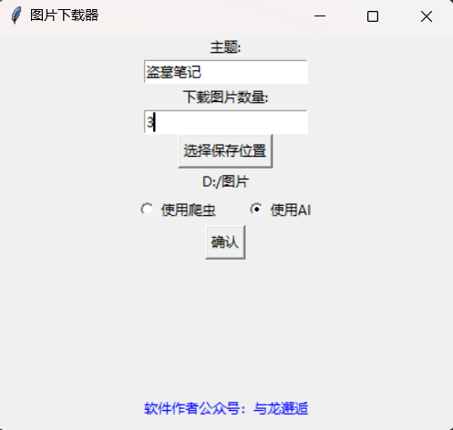

# project
全自动化智能化的图片下载器

目前只是支持 windows 11 64bit，后续会考虑更多 macos 等等

#  dev log
- [x] 9/17，开发出版本 v1 的图片下载器
  - [x] 目前只支持 windows 桌面版本 app
  - [x] 目前只是百度图片爬虫
  - [x] 目前只是在关掉代理的情况下可以   
  - [x] yu 反应我生成的软件是硬加载支付宝图片，支付宝图片没打包进去，回退。。。 

- [x] 9/18，开发出版本 v2 的图片下载器
  - [x] 设置 proxy 在 http 和 https 都是''，这样有代理情况我也不鸟
  - [x] 更新后的图片下载器无视代理，更加鲁棒。  
  - [x] 在 yu 这里找到打开方式，提示词：**2024 校招海报** 

- [x] 9/19，更新 feature
  - [x] 下载完图片之后，自动打开文件夹，更方便用户（salty 建议） 
  - [x] 增加项目的 【依赖管理文件】使用 venv (感谢 fizz 腾讯视频 建议)
  - [x] 重构代码文件组织，这样更清晰，**2024/09/19 是第一次开始做独立开源工具项目的起点**  
  - [x] 后续会考虑更多的图像源，跨平台支持的 

- [x] 9/20，测试 cursor 的时候发现周五中午下载器失败
  - [x] 我这两天爬虫频率太高，被封 ip 了
    - [x] {'antiFlag': 1, 'message': 'Forbid spider access', 'bfe_log_id': '8719295301275549106'}
  - [ ] 昨晚获得思路，可以用 ai 生成图片（感谢 神魂哥）

- [x] 9/21，增加 ai 生成图片功能，并修改下载器
  - [x] 图片生成只是使用的 glm 的 api token，目前还只是串行，没有多线程，后续会考虑
  
- [x] 9/22，增加 ai 生成图片功能，并修改下载器
  - [x] 发现 chatglm 邀请注册可以领取更多免费额度的，准备公益安利别人下载使用服务 
  - [x] 折腾一通 docker，发现 docker 打包 gui 程序太奢侈太鸡肋了，以后有机会整个网页吧 
  - [x] 初步尝试水印，感觉中文路径相关有点坑，不搞了hhh 
 
  
# 教程
## 软件使用
目前支持 windows

1. win10/11 64位电脑，点击 dist 目录下的 exe 可执行文件启动。
2. 目前支持两种图片下载策略，其一是爬虫，其二是 AI 生成。
3. 电脑建议不开代理运行，爬虫在开不开代理的情况下都 ok的。
4. 爬虫策略，目前只支持百度图片，后续会考虑更多的源。
5. 要体验 AI 生成，请先登录注册智谱的 bigmodel 平台，创建领取免费 api 额度。
6. 如果体验 AI 生图，注册拿到智谱的 api 之后，在电脑设置环境变量



7. 软件使用界面如下：


    


8. 图片下载完成之后，自动打开下载目录

## 代码使用
首先，安装所有的 python 包

```pip install -r requirements.txt```

其次，运行 /src/app.py

```python ./src/app.py```

# 结语
最近 focus AI+ 赋能，欢迎关注公众号 **与龙邂逅**